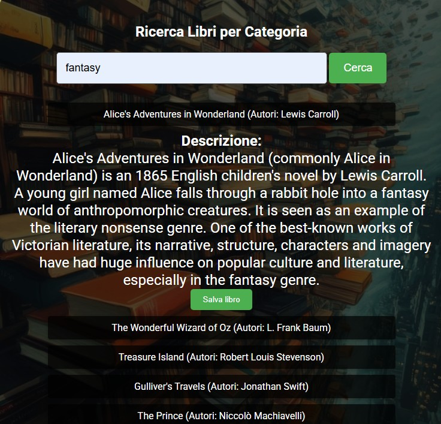

# 📚 Book Finder con Open Library API

Un'applicazione web semplice e intuitiva per cercare libri per categoria sfruttando le API di **Open Library**. Inserendo una categoria (es. `fantasy`), l'utente può visualizzare un elenco di libri con titolo e autori. Con un click, può ottenere anche la descrizione completa del libro selezionato.

👉 **Provala subito:** [LINK ALLA DEMO SU GITHUB PAGES]( https://simonegiannecchini.github.io/SimoneGiannecchini-Progetto-Javascript-Advanced/)

---

## 🔍 Funzionalità principali

- Ricerca di libri tramite categoria (`fantasy`, `horror`, `romance`, ecc.)
- Visualizzazione del **titolo** e degli **autori**
- Visualizzazione della **descrizione del libro** al click
- Interfaccia ispirata allo stile Google
- Chiamate API gestite tramite **Axios**
- Progetto strutturato con **Vite**
- Utilizzo opzionale di **Lodash** per la gestione sicura dei dati

---
## 💾 Funzionalità Extra – Gestione dei Libri Preferiti

### ✅ Visualizzazione dei preferiti salvati

- 📚 Elenco dei libri **salvati dall’utente**
- 🖼️ Ogni libro mostra **copertina + titolo + autori**
- 🔁 Dati gestiti tramite **Firebase Realtime Database**

---

### 🖼️ Gestione copertine

- ✅ Se disponibile → **copertina originale da Open Library**
- 🧱 Se non disponibile → **copertina standard di fallback**

---

### ❌ Rimozione preferiti

- Ogni libro ha un pulsante **"Rimuovi"**
- **Clic** → elimina il libro dai preferiti e aggiorna la lista in tempo reale

---

👉 Una sezione pensata per **organizzare facilmente i propri libri salvati**  
e gestirli in modo **dinamico e personalizzato**

---

## 🛠️ Tecnologie utilizzate

- **Vite** (per sviluppo veloce e build ottimizzata)
- **HTML5 / CSS3**
- **JavaScript**
- [Axios](https://axios-http.com/)
- [Lodash](https://lodash.com/)
- [Open Library API](https://openlibrary.org/developers/api)

---

## 🖼️ Screenshot


*Ricerca per categoria e risultati ottenuti*


*Visualizzazione descrizione di un libro selezionato*

---

## 📥 Come clonare ed eseguire il progetto sul tuo PC

Per lavorare in locale con questo progetto, segui questi passaggi:

### ✅ Requisiti

Assicurati di avere installati sul tuo computer:

- [**Git**](https://git-scm.com/downloads) – per clonare il progetto
- [**Node.js**](https://nodejs.org/) (versione consigliata: LTS) – per eseguire il progetto con Vite
- Un terminale (Prompt dei comandi, PowerShell, Terminale macOS/Linux, o terminale integrato in VS Code)

---

### 🔄 Procedura passo-passo

1. **Apri il Prompt dei comandi o il Terminale**

   Su Windows puoi cercare "Prompt dei comandi" o "PowerShell", oppure apri VS Code e usa il terminale integrato (`Ctrl + ò`).

2. **Clona il repository dal tuo account GitHub**
   ```bash
   git clone https://github.com/SimoneGiannecchini/SimoneGiannecchini-Progetto-Javascript-Advanced.git

**Spostati nella cartella del progetto**
cd SimoneGiannecchini-Progetto-Javascript-Advanced

**Installa tutte le dipendenze del progetto**
npm install
**Avvia il server di sviluppo (con Vite)**
npm run dev
**Apri il progetto nel browser**
VITE vX.X.X  ready in XXX ms

➜  Local:   http://localhost:5173/

## 📝 Licenza

Questo progetto è distribuito sotto licenza **MIT**.


📄 [Visualizza il testo completo della licenza MIT](https://opensource.org/licenses/MIT)


